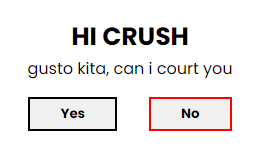

  

  

    Confessions  (haha when)
     
    <a href="https://github.com/jusnie/confessing-#readme>Index.html</a>
    ·
    <a href="https://github.com/jusnie/confessing-#readme">Report Bug</a>
    ·
    <a href="https://github.com/jusnie/confessing-#readme">Request Feature</a>
  

